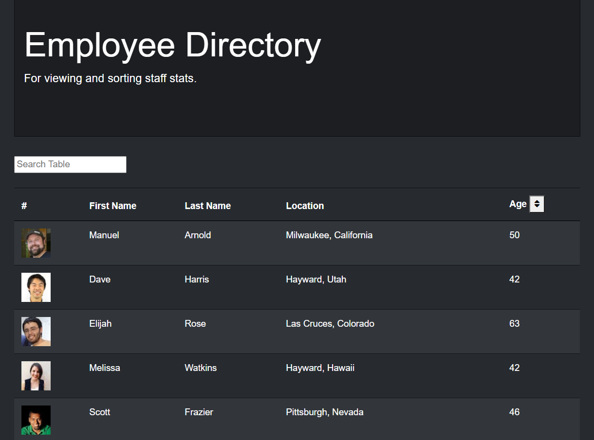
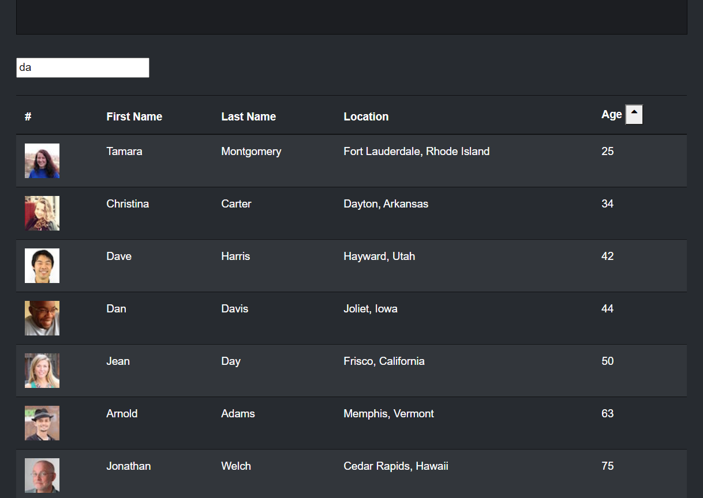

# Employee Directory

## Description

This React application is designed to allow a business to review information about their employee's and sort or search through that data. The styling was done primarily through Bootstrap and Bootswatch and the empoyee information comes from the [Random User API](https://randomuser.me/). Axios was used to incorporate the API into the code. The sorting method was adapted from [Florin Pops tutorial](https://www.florin-pop.com/blog/2019/07/sort-table-data-with-react/), and the search function was adapted from a [Medium article by Bhavya Ambasta](https://medium.com/crobyer/search-filter-with-react-js-88986c644ed5).

## Table of Contents

* [Link](#Link)

* [Screenshot](#Screenshot)

* [License](#license)

* [Questions](#questions)

## Link

[This link will take you to the deployed site on Heroku!](https://pritesh-employee-directory.herokuapp.com/)

## Screenshot

## License

- MIT

- https://opensource.org/licenses/MIT
  
## Questions

If you have any questions about the app, open an issue or contact me through the contact form on my portfolio website: https://priteshpatel823.github.io/. You can find more of my work at [Pritesh Patel](https://github.com/priteshpatel823).
